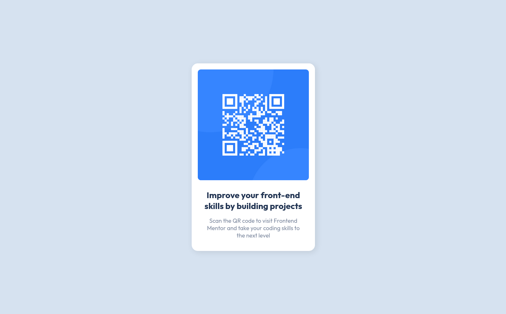

# Frontend Mentor - QR code component solution

This is a solution to the [QR code component challenge on Frontend Mentor](https://www.frontendmentor.io/challenges/qr-code-component-iux_sIO_H). Frontend Mentor challenges help you improve your coding skills by building realistic projects.

## Table of contents

- [Overview](#overview)
  - [Screenshot](#screenshot)
  - [Links](#links)
- [My process](#my-process)
  - [Built with](#built-with)
  - [Useful resources](#useful-resources)
- [Author](#author)

**Note: Delete this note and update the table of contents based on what sections you keep.**

## Overview

### Screenshot

Desktop view

Mobile view

### Links

- Live Solution URL: https://frontend-mentor-qr-code-seven.vercel.app

## My process

### Built with

- Semantic HTML5 markup
- CSS custom properties

### Useful resources

Used this project as an opportunity to review options for aligning items:
https://www.w3schools.com/csS/css_align.asp.

## Author

- Website - https://www.linkedin.com/in/artur-jedrzejczak/
- Frontend Mentor - https://www.frontendmentor.io/profile/aratur
